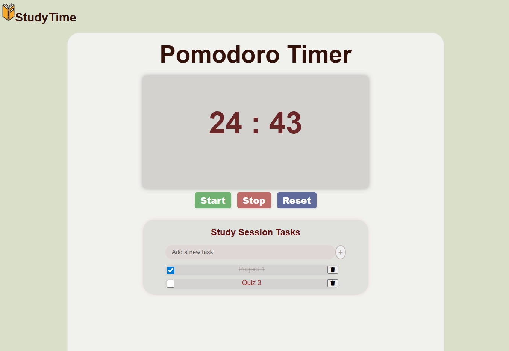
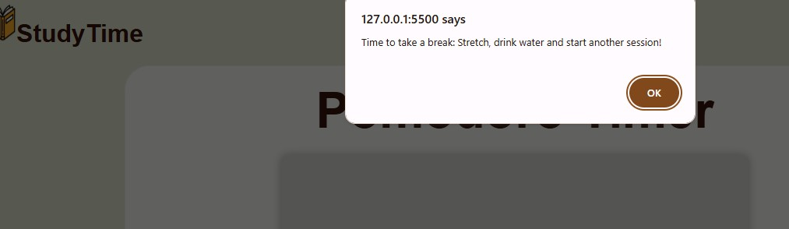

<h1> Pomodoro App</h1>

This is a simple pomodoro app, I personally enjoy working with pomodoro sessions. I usually go for **50 mins sessions** with **10 minutes breaks** but when I don't feel like working on something I trick myself to start with a shorter 25 minutes session. 
 Eventually I'll add more time functionalities, to allow  users to enter their desired study session lengths. 

<h2> Time's Up:</h2>

 At the end of the session you'll get a reminder to take a break: 

